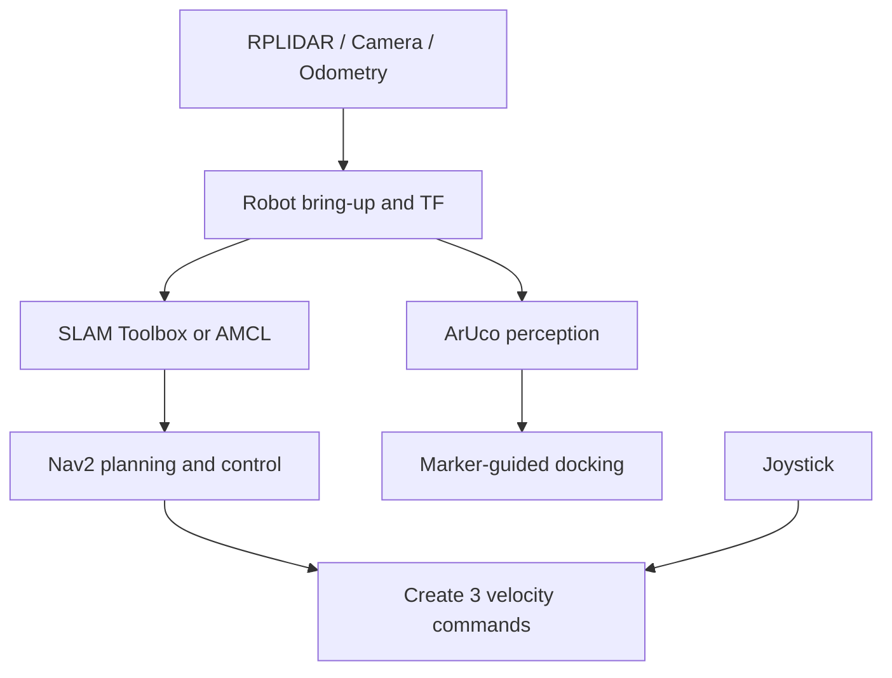

# Create 3 ROS 2 Autonomy Stack

A ROS 2 Humble workspace for autonomous mobile-robot experiments on an iRobot Create 3. The stack integrates 2D LiDAR mapping, AMCL localization, Nav2 navigation, joystick teleoperation, camera-based ArUco perception, TF management, random goal execution, and an experimental marker-guided docking controller.

This project was developed and tested on a real robot during the FH Aachen ROS Summer School.

## Main capabilities

- Robot and sensor bring-up for the iRobot Create 3
- RPLIDAR C1 integration and `/scan` publication
- 2D mapping with SLAM Toolbox
- Saved-map localization with Map Server and AMCL
- Nav2 global and local navigation
- NavFn global planning and DWB local control
- Static TF configuration for the robot, LiDAR, IMU, and camera
- Joystick control with deadman and emergency-stop button logic
- Intel RealSense and USB-camera support
- ArUco marker detection and pose configuration
- Random collision-aware Nav2 goal generation inside configured map bounds
- Experimental ArUco marker-guided approach/docking controller
- RViz visualization

## System overview



## Repository structure

| Package | Purpose |
|---|---|
| `robot_bringup` | Create 3 republisher, camera and LiDAR launch files, TF configuration, ArUco ID node, TF listener, and docking controller |
| `my_robot_slam` | SLAM Toolbox mapping and AMCL/map-server localization |
| `my_robot_navigation` | Nav2 parameters, behavior tree, navigation launch file, and random goal client |
| `teleop` | Joystick-to-`Twist` conversion with deadman and emergency-stop logic |
| `aruco_opencv_bringup` | ArUco detector parameters for image input, marker dictionary, pose scale, QoS, and TF publication |

## Platform

The original workspace used:

- Ubuntu 22.04
- ROS 2 Humble
- Python 3.10
- iRobot Create 3
- RPLIDAR C1
- Intel RealSense or a calibrated USB camera
- Gamepad/joystick
- Nav2, SLAM Toolbox, TF2, OpenCV, and ArUco

A clean dependency installation and `colcon build` was verified in a ROS 2 Humble container. The complete workspace, including the external Create 3 packages, built 11 packages successfully.

## Installation

Create a workspace by cloning this repository:

```bash
git clone https://github.com/oguzissik/create3-ros2-autonomy-stack.git
cd create3-ros2-autonomy-stack
```

The stack uses the official iRobot Create 3 examples as an external dependency. The version used during development was commit `b6b7a50`:

```bash
git clone https://github.com/iRobotEducation/create3_examples.git src/create3_examples
git -C src/create3_examples checkout b6b7a50
```

Install a ROS 2-compatible `rplidar_ros` driver containing `rplidar_c1_launch.py` under `src/`. The robot also requires the ROS packages for Nav2, SLAM Toolbox, RealSense or `usb_cam`, `aruco_opencv`, `cv_bridge`, and `joy`.

Resolve declared dependencies and build:

```bash
source /opt/ros/humble/setup.bash

rosdep update
rosdep install --from-paths src --ignore-src -r -y

colcon build --symlink-install
source install/setup.bash
```

## Running the stack

Each new terminal must source ROS and the workspace:

```bash
source /opt/ros/humble/setup.bash
source install/setup.bash
```

### Robot interfaces and sensors

The launch files can be started separately while testing:

```bash
ros2 launch robot_bringup republisher.launch.py
ros2 launch robot_bringup robot_tf.launch.yaml
ros2 launch robot_bringup lidar.launch.py
ros2 launch robot_bringup camera.launch.py
```

A USB camera can be used instead of the RealSense launch:

```bash
ros2 launch robot_bringup webcam.launch.yaml
```

Useful checks:

```bash
ros2 topic list
ros2 topic echo /scan --once
ros2 run tf2_tools view_frames
```

### Mapping

The SLAM configuration uses:

- `map` as the global frame
- `odom` as the odometry frame
- `base_link` as the robot frame
- `/scan` as the LiDAR topic
- asynchronous SLAM Toolbox in mapping mode

The corresponding configuration is in:

```text
src/my_robot_slam/my_robot_slam/slam_toolbox.launch.yaml
```

### Localization

Before starting localization, update `yaml_filename` in:

```text
src/my_robot_slam/launch/localization.launch.yaml
```

so that it points to the map YAML on the current machine. Then run:

```bash
ros2 launch my_robot_slam localization.launch.yaml
```

In RViz:

1. Set the fixed frame to `map`.
2. Confirm that `/map`, `/scan`, `/amcl_pose`, and `/particle_cloud` are available.
3. Use **2D Pose Estimate** if the configured initial pose is not correct.

### Nav2 navigation

Start the navigation stack with the project parameter file:

```bash
ros2 launch my_robot_navigation robot_nav.launch.py \
  use_sim_time:=false \
  params_file:=$PWD/src/my_robot_navigation/config/nav2_params.yaml
```

The configuration contains:

- NavFn global planner
- DWB local planner
- Local rolling costmap
- Global static/obstacle costmap
- LiDAR clearing and marking
- Inflation layers
- Recovery actions
- A custom navigation behavior tree

To send repeated random Nav2 goals inside the configured map bounds:

```bash
ros2 run my_robot_navigation explorer_node
```

This node samples random valid goal coordinates inside manually configured limits. It is not a frontier-exploration algorithm.

### Joystick teleoperation

Start the joystick driver and the custom converter:

```bash
ros2 run joy joy_node
ros2 run teleop JoyToCmdVel
```

The node publishes to `/create3/cmd_vel`. Button index 4 is used as the deadman switch, and button index 5 commands an immediate zero velocity. Update the indices for a different controller layout.

### ArUco perception

The lightweight detector reads:

```text
/camera/camera/color/image_raw
```

and reports detected marker IDs:

```bash
ros2 run robot_bringup aruconode
```

The `aruco_opencv_bringup` package additionally contains pose-estimation parameters, including image QoS, marker size, detector tuning, and TF publication.

The marker dictionary must match the printed marker. The lightweight node currently uses `DICT_5X5_100`, while the pose configuration uses `4X4_50`; select one consistent dictionary before running a complete perception pipeline.

### Marker-guided docking

The experimental controller looks up `marker_19` relative to `base_link`, applies proportional linear and angular corrections, and stops at a target distance of approximately 0.10 m:

```bash
ros2 run robot_bringup driver_node
```

Run this only after verifying the marker TF, command topic routing, speed limits, and available stopping space.

## Important configuration

Several values are specific to the original test environment and should be reviewed before reuse:

- Map path and AMCL initial pose in `localization.launch.yaml`
- Map bounds in `auto_explorer.py`
- Sensor transforms in `robot_tf.launch.yaml`
- RPLIDAR model and serial-port permissions
- Camera device, resolution, and calibration
- ArUco dictionary, marker size, and marker ID
- Joystick axis and button indices
- Nav2 footprint/radius, velocities, accelerations, and costmap inflation

## Safety

The current `camera.launch.py` sends commands that set the Create 3 safety override to `backup_only` and disable reflexes. These settings reduce built-in protective behavior.

Review or remove those commands before operating the robot. Test with low speed, clear space, an accessible physical stop method, and a person ready to intervene. Never assume that software emergency-stop logic replaces a physical emergency stop.

## Project status

- Source packages: available
- Clean ROS 2 Humble build: verified
- Real-robot integration: performed during the FH Aachen ROS Summer School
- SLAM, map handling, AMCL, Nav2, teleoperation, and perception components: included
- Marker-guided docking: experimental and environment-dependent
- Raw calibration images, build artifacts, virtual environments, and unfinished YOLO work: intentionally excluded

## Acknowledgements

Developed during the FH Aachen ROS Summer School using an iRobot Create 3 platform.

The official [iRobot Education Create 3 examples](https://github.com/iRobotEducation/create3_examples) are used as an external dependency and remain under their original ownership and license.
